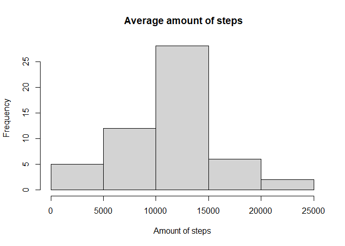
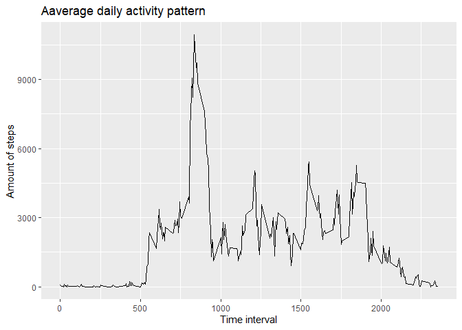
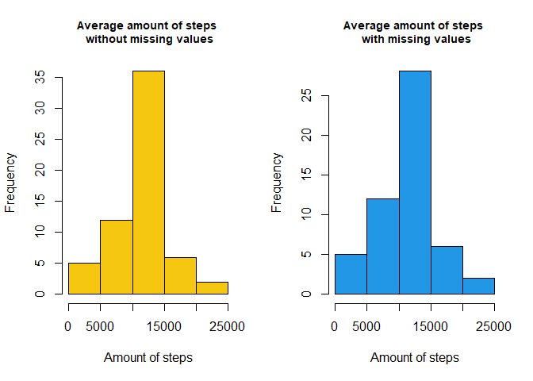
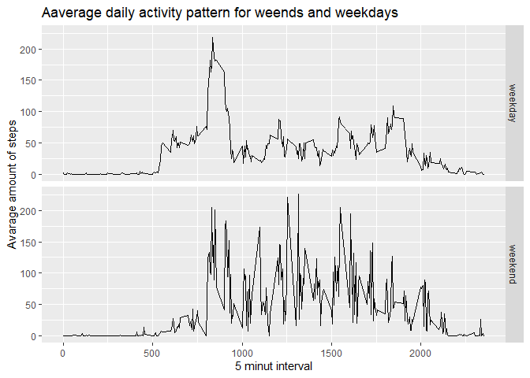

## Loading and preprocessing the data


```r
#opening and modification of activity data set
filename <- "activity.zip"
if(!file.exists("activity")){
  unzip(filename)}
  data <- read.csv("activity.csv", header = TRUE)
  data$date <- as.Date(data$date, "%Y-%m-%d")
```


```r
#opening required libraries
library(ggplot2)
library(dplyr)
```

## What is mean total number of steps taken per day?


```r
day_sum <- aggregate(steps ~ date,data, FUN = sum)
print(day_sum)
```

```
##          date steps
## 1  2012-10-02   126
## 2  2012-10-03 11352
## 3  2012-10-04 12116
## 4  2012-10-05 13294
## 5  2012-10-06 15420
## 6  2012-10-07 11015
## 7  2012-10-09 12811
## 8  2012-10-10  9900
## 9  2012-10-11 10304
## 10 2012-10-12 17382
## 11 2012-10-13 12426
## 12 2012-10-14 15098
## 13 2012-10-15 10139
## 14 2012-10-16 15084
## 15 2012-10-17 13452
## 16 2012-10-18 10056
## 17 2012-10-19 11829
## 18 2012-10-20 10395
## 19 2012-10-21  8821
## 20 2012-10-22 13460
## 21 2012-10-23  8918
## 22 2012-10-24  8355
## 23 2012-10-25  2492
## 24 2012-10-26  6778
## 25 2012-10-27 10119
## 26 2012-10-28 11458
## 27 2012-10-29  5018
## 28 2012-10-30  9819
## 29 2012-10-31 15414
## 30 2012-11-02 10600
## 31 2012-11-03 10571
## 32 2012-11-05 10439
## 33 2012-11-06  8334
## 34 2012-11-07 12883
## 35 2012-11-08  3219
## 36 2012-11-11 12608
## 37 2012-11-12 10765
## 38 2012-11-13  7336
## 39 2012-11-15    41
## 40 2012-11-16  5441
## 41 2012-11-17 14339
## 42 2012-11-18 15110
## 43 2012-11-19  8841
## 44 2012-11-20  4472
## 45 2012-11-21 12787
## 46 2012-11-22 20427
## 47 2012-11-23 21194
## 48 2012-11-24 14478
## 49 2012-11-25 11834
## 50 2012-11-26 11162
## 51 2012-11-27 13646
## 52 2012-11-28 10183
## 53 2012-11-29  7047
```

# Histogram for number of steps


```r
hist(day_sum$steps, ylab = "Frequency", xlab = "Amount of steps", main = " Average amount of steps")
```

<!-- -->

```r
dev.copy (png, "plot1.png", width=480, height=480)
dev.off()
```

# Calculation of mean and median

```r
meanSteps <- mean(day_sum$steps, na.rm = TRUE)

medianSteps <- median(day_sum$steps, na.rm = TRUE)
```

The average number of steps per day is **1.0766189\times 10^{4}**.
The median of number of steps per day is **10765**.


## What is the average daily activity pattern?


```r
data_intervals <- aggregate(steps ~ interval, data, FUN = sum)
graph <- ggplot(data_intervals, aes(x = interval, y = steps))
graph + geom_line() + xlab("Time interval") + ylab ("Amount of steps") + labs(title ="Aaverage daily activity pattern")
```

<!-- -->

```r
dev.copy (png, "plot2.png", width=480, height=480)
dev.off()
```

## Imputing missing values


```r
# calculating number of missing values
number_of_NAs <- sum(!complete.cases(data))

# calculating mean for given time interval
mean_data_intervals <- aggregate(steps ~ interval, data, FUN = mean)

# creating a new data set with missing values replaced with average for the given interval
noNA_data <- merge(data,mean_data_intervals, by = "interval")
noNA_data$newsteps <- ifelse(is.na(noNA_data$steps.x), noNA_data$steps.y, noNA_data$steps.x)
new_data <- select(noNA_data, date, newsteps, interval)

# crating histogram for the total number of steps taken each day for data set with and without NA's
noNa_data_day_sum <- aggregate(newsteps ~ date, new_data, FUN = sum)
par(mfrow = c(1,2))
hist(noNa_data_day_sum$newsteps, ylab = "Frequency", xlab = "Amount of steps", main = "Average amount of steps \n without missing values", cex.main = 0.9, col = 7)
hist(day_sum$steps, ylab = "Frequency", xlab = "Amount of steps", main = "Average amount of steps \n with missing values", col = 4, cex.main = 0.9)
```

<!-- -->

```r
dev.copy (png, "plot3.png", width=480, height=480)
dev.off()
```
There is **2304** on missing values.


```r
#comparison of mean and median for data sets without and with missing values

meanSteps_NA <- mean(day_sum$steps, na.rm = TRUE)

medianSteps_NA <- median(day_sum$steps, na.rm = TRUE)

meanSteps_no_NA <- mean(noNa_data_day_sum$newsteps)

medianSteps_no_NA <- median(noNa_data_day_sum$newsteps)
```

The average number of steps per day with missing values is **1.0766189\times 10^{4}** and without is **1.0766189\times 10^{4}**.
The median of number of steps per day with missing values is **10765** and without is **1.0766189\times 10^{4}**.


## Are there differences in activity patterns between weekdays and weekends?


```r
new_data$type_of_day <- ifelse(weekdays(new_data$date) == c("niedziela","sobota"), "weekend","weekday")
new_data_interval_mean <- aggregate(newsteps ~ interval + type_of_day, new_data, FUN = mean)
graph_weekend <-ggplot(new_data_interval_mean, aes(x = interval, y = newsteps))
                       graph_weekend + geom_line() + facet_grid(type_of_day~.) + xlab ("5 minut interval") + ylab("Avarage amount of steps") + labs(title ="Aaverage daily activity pattern for weends and weekdays")
```

<!-- -->

```r
dev.copy (png, "plot4.png", width=480, height=480)
dev.off()
```
